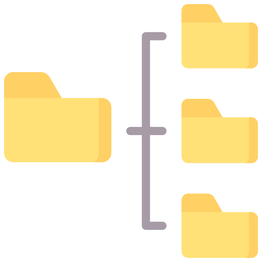

  

<h1 align="center">
  uripath Package for Go
</h1>

  Library for managing files and data through URI paths.

  
  
  
  
  
   
  
  
  
   
  
  

 

<!-- omit in toc -->
## Table of Contents

- [👁️ Overview](#️-overview)
- [✅ Requirements](#-requirements)
- [📃 License](#-license)
- [❓ Questions, Issues and Feature Requests](#-questions-issues-and-feature-requests)

## 👁️ Overview

`go.innotegrity.dev/mod/uripath` is a library which allows you to download, list, remove and upload content from various sources including the local filesystem, S3-compatible stores, git repositories, secrets managers and more.  The library allows you to extend the supported backend stores through its `RegisterBackend` function and the `URIPathBackend` interface.

Please review the [module documentation](https://pkg.go.dev/go.innotegrity.dev/mod/uripath) for details on how to properly use the functions and types contained in this module.

## ✅ Requirements

This module is supported for Go v1.25.1 and later.

## 📃 License

This module is distributed under the MIT License.

## ❓ Questions, Issues and Feature Requests

If you have questions about this project, find a bug or wish to submit a feature request, please [submit an issue](https://gitlab.com/innotegrity/modules/go/uripath/-/issues).
